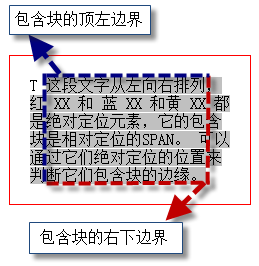
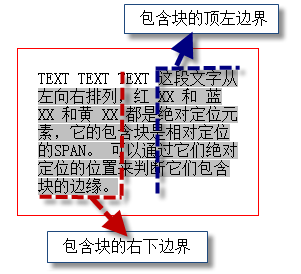
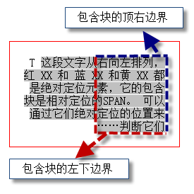

# CSS标准

## [Containing block 包含块](http://www.w3.org/TR/CSS2/visuren.html#containing-block)

在css2.1中很多定位和尺寸的计算，都是相对于一个矩形区域，这个区域就叫做包含块，如以下的标准：

**"top":**

`Percentages:  	refer to height of containing block`

包含块的判定流程为：

另: td(display:table-cell)的包含块是table(display:table)

三种比较少见的包含块，灰色区域是span，position是relative

'direction' 是 'ltr'

'direction' 是 'rtl'

## [height](http://www.w3.org/TR/CSS2/visudet.html#the-height-property)

当height的值为百分比的时候，基数为包含块:

1.如果包含块`没有设置height值`，则这个百分比值无效，将自动转换为`auto`。

2.如果当前元素为`absolute`，则会自动计算包含块`padding盒子`的高度为基数。

## [margin-top,margin-bottom](http://www.w3.org/TR/CSS2/box.html#margin-properties)

为内联元素设置margin，仅仅`左右margin有效`

当上下margin的值为百分比的时候，基数为包含块的`宽度`而非高度