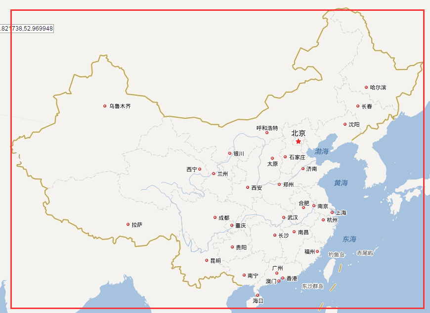

# 百度地图

### 典型用法
<pre><code data-language="javascript">//初始化
var map = new BMap.Map($('.map-content')[0]);
var point = new BMap.Point(108.483525, 35.254578); //中国中心
map.centerAndZoom(point, 4);
map.enableScrollWheelZoom();

//创建marker及icon
var icon = '图片地址';
var bIcon = new BMap.Icon(icon, new BMap.Size(43, 55));
var bPoint = new BMap.Point(point.lng, point.lat);
var marker = new BMap.Marker(bPoint, {
    icon: bIcon
});
//让图标的底部中心指向地图点
marker.setOffset(new BMap.Size(0, -55 / 2));
map.addOverlay(marker);
//更新marker位置
marker.setPosition( new BMap.Point(point.lng, point.lat) );
//marker跳动
marker.setZIndex(this.maxZindex++);
setTimeout(function(){
    marker.setAnimation(BMAP_ANIMATION_BOUNCE);
}, 300);
setTimeout(function(){
    marker.setAnimation(null);
}, 1500);

//按照多个点居中
this.map.setViewport([new BMap.Point(point.lng, point.lat)， new BMap.Point(point1.lng, point1.lat)]);
</code></pre>

## 转换gps坐标为百度地图的坐标

符合百度转换规则的点为
<pre><code data-language="javascript">function checkPoint(lon, lat){
    return lon > 73 && lon < 137 && lat > 1 && lat < 55;
}
</code></pre>

`经度必须在73到137之间，纬度在1到55之间，即中国地图所在的长方形`

[官方纠偏文档](http://developer.baidu.com/map/index.php?title=webapi/guide/changeposition) 最多转换100个点，如果点有错，将全部转换失败,因此在使用前先用上面的checkPoint判断

### 以下方法最多转换20个点，错误的点会返回{"error":-5}

<pre><code data-language="javascript">function getBaiduPointsByGps(pointsArr, callback){
    var xPoints = [];
    var yPoints = [];

    for(var i = 0; i < pointsArr.length; i++){
        var point = pointsArr[i];
        xPoints.push(point.lng);
        yPoints.push(point.lat);
    }

    $.ajax({
        url: 'http://api.map.baidu.com/ag/coord/convert?from=0&to=4&mode=1&x='+ xPoints.join(',') +'&y='+ yPoints.join(','),
        dataType: 'jsonp',
        success: function(xyResults){
            var xyResult = null;
            var finallyResults = [];
            for(var i = 0; i < xyResults.length; i++){
                xyResult = xyResults[i];
                if(xyResult.error != 0){
                    callback(null);
                    return;
                }
                finallyResults.push(xyResult);
            }
            callback(finallyResults);
        },
        error: function(){
            callback(null);
        }
    });
}

/**
* 调用方法： getBaiduPointsByGps([{lng:116,lat:10},{lng:116,lat:11}], function(res){console.log(res)})
* 返回res内容： [
    {
        error: 0,
        x: "MTE2LjAxMDQ2Njg2OTU5",
        y: "MTAuMDAzOTgxMzUyMw=="
    },
    {
        error: 0,
        x: "MTE2LjAxMDQ3NDIyOTI3",
        y: "MTEuMDA0MjE1NzY2NTM4"
    }
]
****  注意，这里的x、y是加密后的百度地图坐标，可以作为经纬度传递给百度地图使用。比如构造一个new BMap.Point("MTE2LjAxMDQ3NDIyOTI3", "MTEuMDA0MjE1NzY2NTM4");
      另外，对于国外的gps地址，由于不需要纠偏，百度地图会返回{ error: -1}。此时直接使用纠偏前坐标即可。
*/

</code></pre>

## 转换百度坐标为gps坐标

<pre><code data-language="javascript">function getGpsPointsByBaidu(pointsArr, callback){
    var xPoints = [];
    var yPoints = [];
    for(var i in pointsArr){
        xPoints.push(pointsArr[i].lng);
        yPoints.push(pointsArr[i].lat);
    }
    $.ajax({
        url: 'http://api.map.baidu.com/ag/coord/convert?from=0&to=4&mode=1&x='+ xPoints.join(',') +'&y='+ yPoints.join(','),
        dataType: 'jsonp',
        success: function(xyResults){
            var xyResult = null;
            var point = null;
            var xGps;
            var yGps;
            var finallyResults = [];
            for(var i = 0; i < xyResults.length; i++){
                xyResult = xyResults[i];
                if(xyResult.error != 0){ //如果有error，代表纠偏失败，使用原坐标
                    finallyResults.push(pointsArr[i]);
                }else{
                    point = new BMap.Point(xyResult.x, xyResult.y);
                    //gps坐标转换公式xPoints是以前的百度坐标，point是把以前的百度坐标当成gps坐标转换成的百度坐标
                    xGps = 2 * xPoints[i] - point.lng;
                    yGps = 2 * yPoints[i] - point.lat;
                    finallyResults.push({
                        lng: xGps,
                        lat: yGps
                    });
                }

            }
            callback(finallyResults);
        },
        error: function(){
            callback(null);
        }
    });
}
/**
* 调用方法： getGpsPointsByBaidu([{lng:116,lat:10},{lng:116,lat:11}], function(res){console.log(res)});
* 返回res内容： [
    {
        lat: 9.9960186477,
        lng: 115.98953313041
    },
    {
        lat: 10.995784233462,
        lng: 115.98952577073
    }
]
*/
</code></pre>