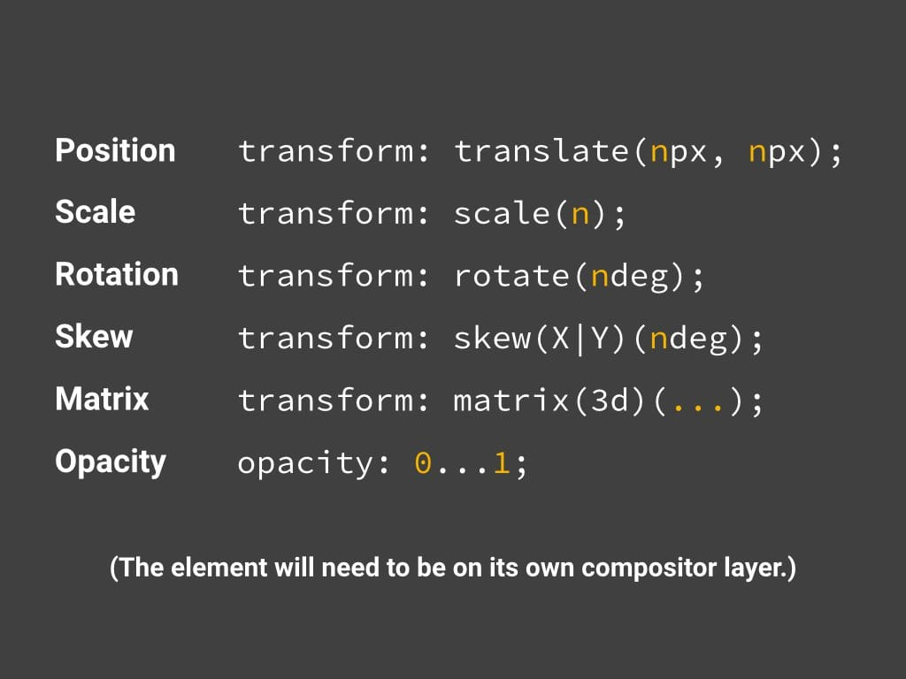

# 谷歌调试工具和性能优化

## chrome调试工具

### 官方文档

[chrome调试工具官方文档](https://developers.google.com/web/tools/chrome-devtools/?hl=zh-cn)

### 性能调试

在performance项里调试性能，通过ctrl+shift+p可以调出调试工具的drawer，选择show paint可以让浏览器显示出重绘区域

开启show paint后的效果：

## 性能优化

[谷歌性能优化专题](https://developers.google.com/web/fundamentals/performance/why-performance-matters/)

### 强制重新布局

指某一个requestAnimationFrame的执行函数中存在改变了元素样式后立即获取元素大小或者位置的值，从而使得浏览器不得不立即执行layout(狐火成为reflow重绘)。

如以下的代码：
<pre><code data-language="javascript">// Schedule our function to run at the start of the frame.
requestAnimationFrame(logBoxHeight);

function logBoxHeight() {

  box.classList.add('super-big');

  // Gets the height of the box in pixels
  // and logs it out.
  console.log(box.offsetHeight);
}
</code></pre>

正常情况下，requestAnimationFrame的执行顺序为：

执行回调函数=》计算style=》布局=》绘制=》合成

可以看到这里的布局是异步的，如果强制同步布局，将使得在执行回调函数阶段执行一次布局任务，大大增加了执行回调函数阶段的时间消耗，从而降低动画性能。

### 尽量使用仅会执行合成步骤的css属性

使用 RAIL 模型评估性能：
https://developers.google.com/web/fundamentals/performance/rail

渲染性能：
https://developers.google.com/web/fundamentals/performance/rendering/
三种模式，最好只用仅合成的模式

要用仅合成的模式，就需要用[仅合成的css样式](https://developers.google.com/web/fundamentals/performance/rendering/stick-to-compositor-only-properties-and-manage-layer-count)

下面看个例子。当我们使用margin-left和transition-duration来移动一个蓝色边框的方块时，可以看到蓝色方块和背景都在同一层，且在移动的时候蓝色方块及其兄弟节点被不断的重绘，`"我是背景"和wrapper是同级节点，它并没有被重绘，应该是浏览器做了优化，但是它和wrapper在同一层`

而当我们改用transform来移动蓝色方块后，此时没有任何重绘，只有组合步骤，可以看到蓝色方块在一个新的层中。

