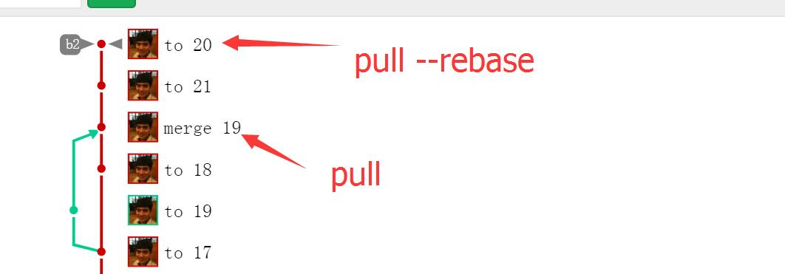

# git

## git描述

一个git项目一旦被克隆就包含了所有信息。如各个分支、各个改动等。如果服务器新建了分支，只需git pull即可访问分支

## ssh环境配置

ssh协议需要软件实现，windows的cmd是没有ssh软件的，需要git bash支持

使用ssh key，只需要在本地生成公钥，再把公钥上传到github里，就可以直接克隆github的项目了，无需输入密码

### 配置ssh key步骤

打开gitbush，首先在用户文件夹里建立一个.ssh的文件夹：

`cd ~`

`mkdir .ssh`

1.生成私钥公钥 ssh-keygen   回车到底

2.把.ssh文件夹的公钥id_rsa.pub上传到github，github的ssh key页面提供上传功能

3.保证使用ssh形式clone的github项目，直接push就可以成功，无需输入密码

如果项目是https协议或者没有ssh key，则每次都需要输入用户名和密码。

### 如果一台电脑两个ssh账号，则需要生成两个ssh

1.切换到.ssh目录，执行 ssh-keygen -t rsa -C "your-email-address" 执行后输入一个名称如id_rsa_qq

2.把生成的id_rsa_qq.pub里的东西粘贴到git上

3.先执行 eval "$(ssh-agent)"，再执行 ssh-add ~/.ssh/id_rsa_qq 把生成的key加到ssh里

4.再修改config文件 ：

Host github
  HostName github.com
  IdentityFile ~/.ssh/id_rsa

Host github_qq
  HostName github.com
  IdentityFile ~/.ssh/id_rsa_qq

`修改后，clone的时候要把github.com改为github_qq`

5.最后在项目下修改提交者的用户名和用户邮箱： git config user.name "lmj"  git config user.email "627574754@qq.com"

这样不方便的就是clone的时候需要修改下地址，二是需要从新指定提交者的邮箱，不然就会默认用global里的用户名和邮箱来提交了。

注意，如果指定了一个github上不存在的邮箱，在commit信息里会只显示用户名。

一旦使用了这个sshkey成功push了代码 sshkeys页面的key前的灰色圆点就会变为绿色。

## gitignore

文件 .gitignore 的格式规范如下：

* 所有空行或者以注释符号 ＃ 开头的行都会被 Git 忽略。

* 可以使用标准的 glob 模式匹配。

* 匹配模式最后跟反斜杠（/）说明要忽略的是目录。

* 要忽略指定模式以外的文件或目录，可以在模式前加上惊叹号（!）取反。

## git config

conf文件有三处 --system则为etc目录，--global则为用户目录，无参数则为当前项目的目录。优先级为项目>global>system

system里的配置对所有用户生效，global对当前用户生效

`$ git config --global user.name "John Doe"`

`$ git config --global user.email johndoe@example.com`

`git config --list` 列出所有配置，有时候会看到重复的变量名，那就说明它们来自不同的配置文件（比如 /etc/gitconfig 和 ~/.gitconfig），不过最终 Git 实际采用的是最后一个。

`git config user.name` 列出用户名

## git status

status可以查看文件的多个状态。未加入版本控制、已编辑待暂存、已暂存待提交、冲突等等

## git checkout

* 用于分支切换，如，`git checkout master`，`git checkout develop`

* 用于把修改后还未进入暂存态的文件恢复到修改前的状态，对已经进入暂存态的文件checkout是无效的

## git add

add具有丰富的功能

* 把未受版本控制的文件加入版本控制 git add filePath

* 把修改过的文件变为已暂存状态，下次commit的时候才会提交此文件

* 一旦进入暂存态，要想回到修改之前就需要git reset HEAD

如果要add本目录下所有子文件： `git add .`

## git commit

提交文件

-a 代表提交本项目所有受版本控制了的文件，不管在不在暂存态

-m 代表注释

## git pull

拉取最新的文件到本地

### 关于pull --rebase

+ 在pull无冲突的情况下，加不加rebase，graph效果都是一样的，虽然他们的实现路径不一样。

+ 如果git pull的时候无冲突，那两个人在同一个分支上操作，最后graph上仍然是一条直线

+ 如果git pull有冲突，解决冲突后会生成一个新的commit节点，这个节点来自于被merge的两个commit

+ 为了防止git pull有冲突的情况下产生新的节点graph不是一条直线，我们可以用git pull --rebase，这样解决掉冲突后并不会生成新的commit节点，比如在commit a上面pull b，解决冲突后不会生成新的commit c而还是是commit a，只是这个时候的commit a已经不是以前那个commit a了，如下图：

 

## git push origin develop

提交develop分支到服务器

## git diff

直接输入 git diff 对比的是修改之后还没有暂存起来的变化内容

如果所有文件都已暂存，git diff将没任何差异，要查看已暂存的和上版本的差异，使用`git diff --staged`

## git log

单纯的git log会一行一行的展示出所有的提交

git log -p -2 会展示出最近2次提交和每次提交的修改内容

## git reset

git reset --hard adb5ab9348dcc65fca3254cbce2c070c390543b4 直接把当前的head指向某个commit，这个commit以后的内容将被丢弃。

如果reset后无法push，则需要在git网站里对分支的push权限进行设置。

## git revert

git revert -n 7524dd77c0c290700cb231ff139c0021b456c40f

rever可以用某个commit覆盖当前的版本，但是会起冲突，需要解决冲突后再push。revert的好处在于保留了所有版本。

[更多log功能](https://git-scm.com/book/zh/v1/Git-%E5%9F%BA%E7%A1%80-%E6%9F%A5%E7%9C%8B%E6%8F%90%E4%BA%A4%E5%8E%86%E5%8F%B2)

## git remote

列出当前仓库的所有远程仓库

`git remote -v` 列出远程仓库及其地址 v代表verbose，即冗长

`git remote show origin` 可以查看远程仓库的各种信息和所有分支

## git rm

删除文件也删除版本控制

git rm --cached README.MD 会将README.MD解除版本控制，但是不会删除它
ASZ 
如有误删，先用git reset HEAD fileName 再 git checkout fileName来恢复文件

## git merge

把b2 merge 到 b1 说白了就是把b2的所有修改一条条放到b1上对比，如果b1没改这里，就改掉，如果b1也改了，就报冲突等待解决。

如果merge出现了冲突，必须解决冲突后commit一下。

如果冲突后想要放弃merge 可以用git merge --abort。

## 开分支

### 创建分支

git branch mystudygit1.0

分支创建后，需要push到服务器服务器才能有新分支。

其他人需要pull后才能看到新分支

### 切换分支
git checkout mystudygit1.0

### 删除分支
git branch -d mystudygit1.0  //如果该分支没有合并到主分支会报错
或者
git branch -D mystudygit1.0   //强制删除

删除远程分支：
git push origin :b3

### 仓库转移

git clone --bare git@code.iotplat.net:dengmingdeng/hotsense.git

cd hotsenese.git

git push --mirror git@gitlab.onenet.com:limengjun/hotsense.git

说明：需要先在新仓库里建立对应的仓库，然后push到这个仓库
